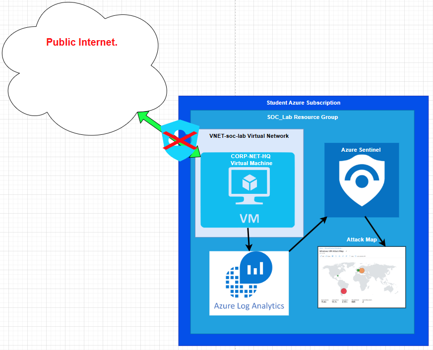
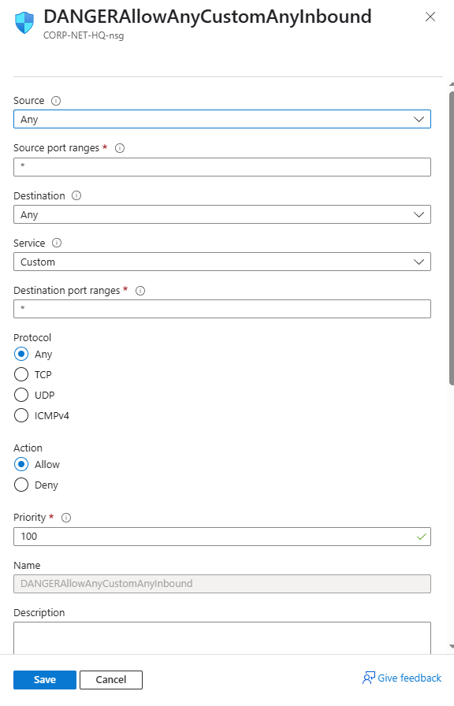
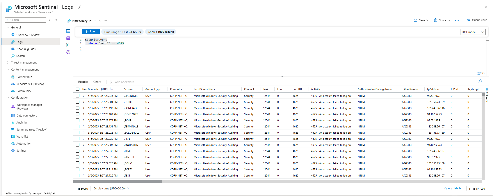
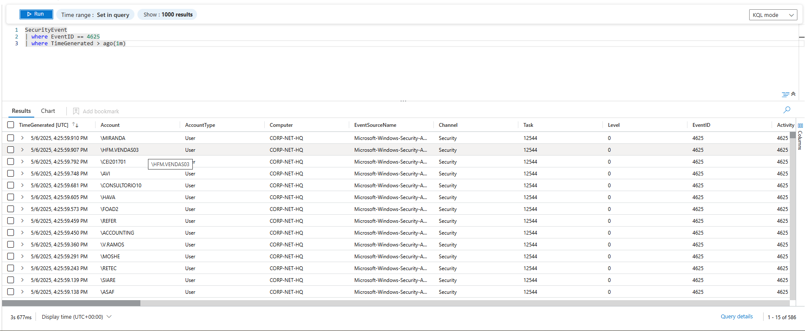
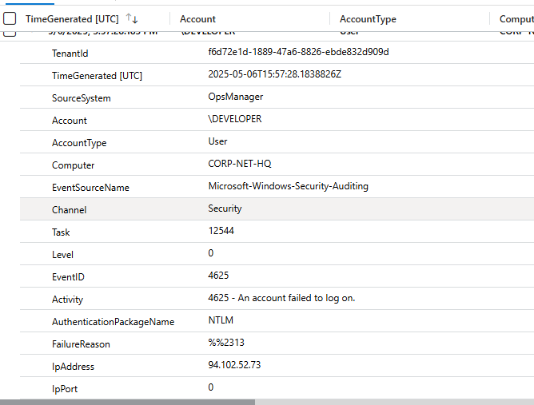
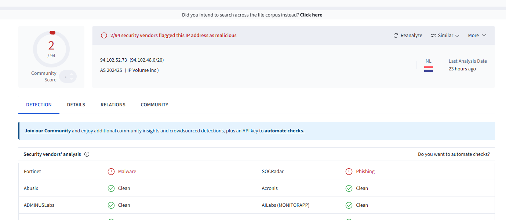
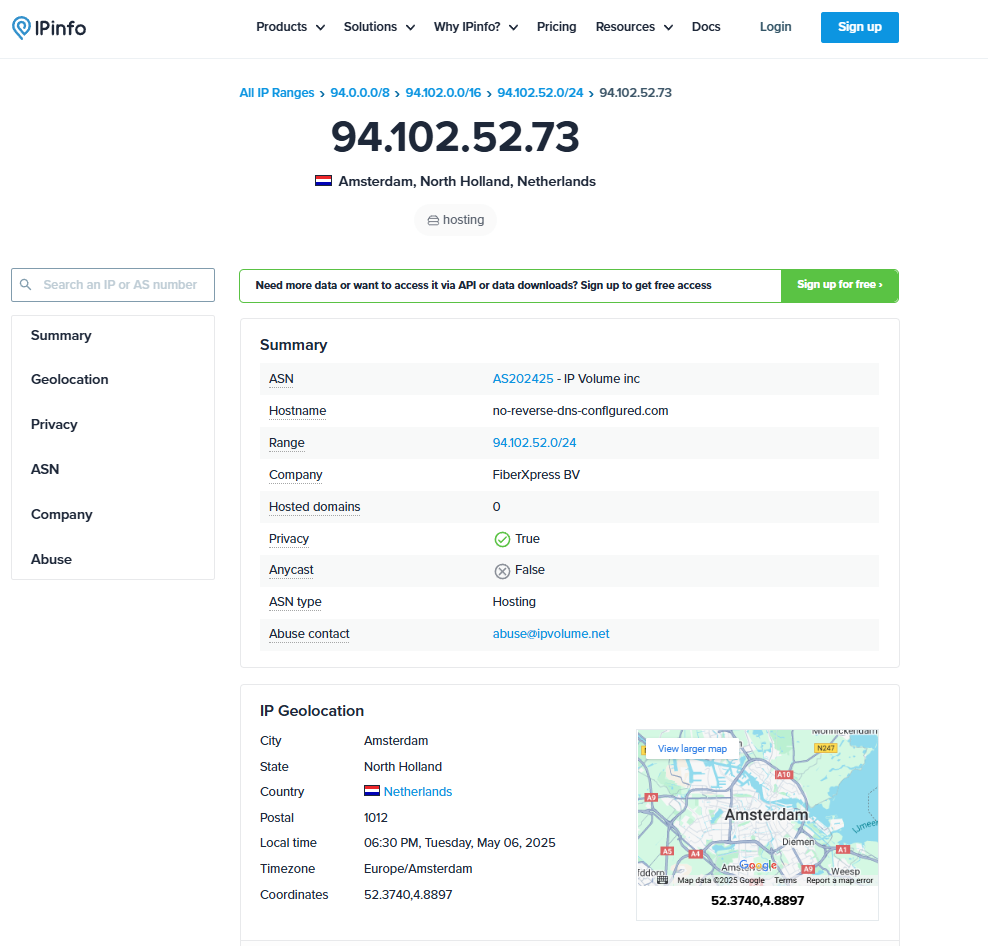
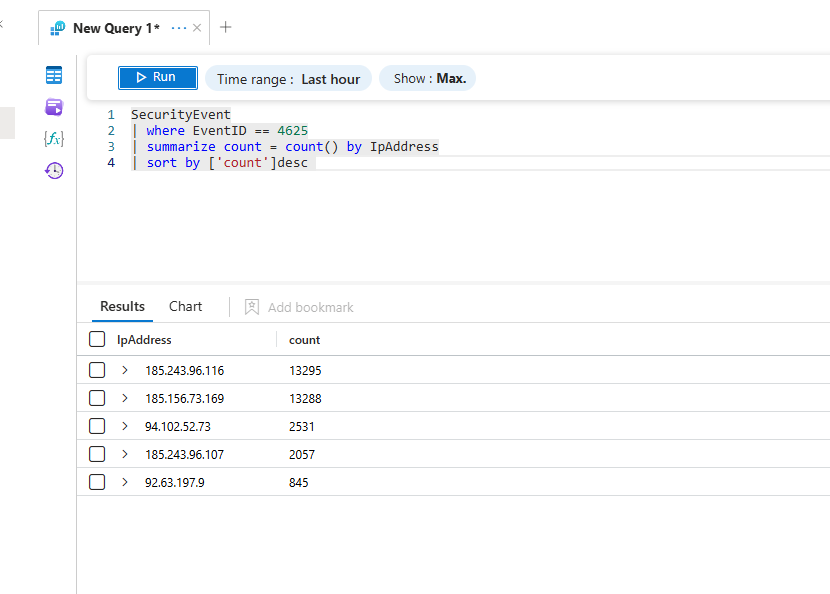

# Azure SOC Lab Project

## Overview
I set up an Azure environment using the Azure for Students subscription to simulate a small-scale Security Operations Center (SOC). Within this environment, I created a virtual machine (VM), disabled its firewall settings, and exposed it directly to the open internet to monitor attack attempts in real time. The goal was to forward logs to Microsoft Sentinel (a SIEM tool) and analyze the activity.

## Goals
The main goals of this project were:

* To gain hands-on experience with Azure, Microsoft Sentinel, and KQL (Kusto Query Language)

* To simulate a real-world environment for security monitoring

* To explore how attackers target exposed systems and how those attacks appear in logs

## Lab Set Up

I started by creating an Azure for Students subscription and set up the necessary components:

* A new resource group

* A virtual network

* A honeypot VM (with all firewall settings disabled)

* Inbound security rules allowing all traffic from any source

Next, I configured a Log Analytics Workspace to collect the logs and forward them to Microsoft Sentinel. Once the logs were flowing in, I created a workbook to visualize attack patterns by mapping IP addresses to their geographic locations using a CSV file with IP-to-location data. 

## Results
Within 10 minutes of putting the VM online, Sentinel began receiving failed login attempts. Using KQL, I filtered the logs by EventID 4625 — which corresponds to failed login attempts in Windows Event Viewer. You can see we logged over 1,000 attempts in just a few minutes:

This made me curious as to how many attempts we were getting so I did some poking around with different queries. Next you see here that even when I narrow it down to the last minute we still have over 500 attempts! 

I decided to open one of the attempts at random to look into closer. You can see our log entry provides a ton of data. We can see the account name the attacker attemped to log in with, the IP the request came from, and we also see that 4625 "ac account failed to log in" message and the failure reason 2313 which means "Unknown user name or bad password." This makes sense because that account name DEVLOPER does not exist on our machine. 

Next I decided to look up the IP address that was attempting to log in. You can see the results of a virus total scan and an ipinfo.io search. Looks like someone in the Netherlands is trying to log in to our machine! Viorus Total throws some red flags too. 

While it’s tempting to picture a room full of hackers in hoodies typing away at keyboards, the reality is less dramatic. These are likely bots scanning the internet for vulnerable machines. Many of the attacks appeared to be brute-force or password-spraying attempts using common username and password combinations.

To explore this, I ran a KQL query to count the number of login attempts by IP address. It turns out a small number of IPs were responsible for thousands of attempts: 

Although you can manually look up IP addresses to check their origin, it's inefficient. To streamline this, I added a watchlist to Sentinel that uses a CSV file mapping IP addresses to their geographic location. I followed a guide by Josh Madakor on YouTube to build the attack map workbook.

Here’s what our attack map looked like after just 2 hours of uptime:

And here is after 4 hours. We have a few new locations pop up. It would be interesting to let it run overnight and see what happens but for now we get a good idea of how it all works and have a good ammount of data to play with. 

## Summary
This project helped me understand:

* How quickly exposed systems are attacked online

* How to use Microsoft Sentinel and KQL to investigate real-world threats

* Working in Azure to set up an enviorment

* The importance of log analysis and automation in security operations

This project was a valuable learning experience that deepened my understanding of SIEM tools and how attackers operate at scale. I also really enjoyed setting up the environment in Azure and using the tools available—it felt intuitive and user-friendly, especially at this scale. I’d love to explore more projects in Azure in the future.

One of my biggest takeaways from this project is the importance of mastering the fundamentals. While anyone working in IT security would know that setting an ANY/ANY rule on a firewall or disabling it entirely is a terrible idea, this lab offered a real-world example of why. Within minutes of going live, our machine was being scanned and targeted by attackers. It was a clear reminder that even basic security misconfigurations can leave systems vulnerable—and that bad actors are always looking for easy targets.